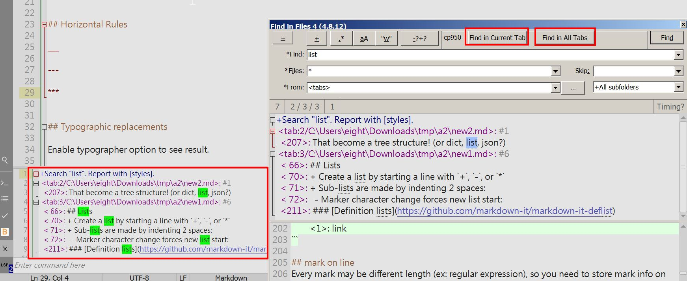

# Find in files X

Everything works like original FiF version, except:

* insert result inside bottom panel like notepad++

* add two buttons:

_Find in Current Tab_ button: 
It finds keywords in the active document.
It ignores `files`, `skip`, `from`, `depth` input fields.

_Find in All Tabs_ button: 
It finds keywords in all opened documents.
It ignores `files`, `skip`, `from`, `depth` input fields.

* add a bottom bar for opening the search result panel

